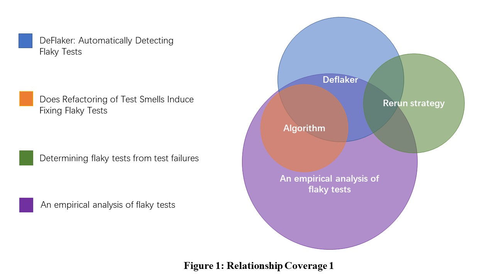
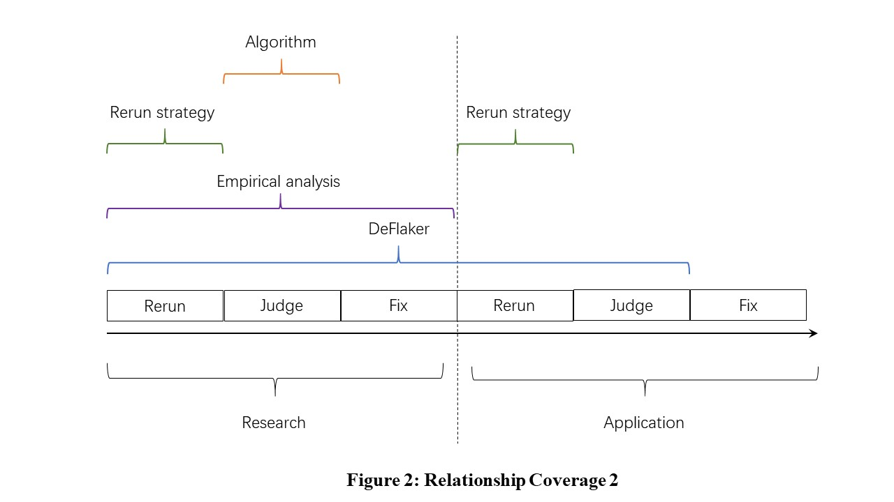

# COMPARISON OF PAPERS RELATED TO FLAKY TEST

@toc

* * *

## OVERVIEW

| Paper      | Strengths|  Limitations| 
| --------- | -------- | -----: |
| Does Refactoring of Test Smells Induce Fixing Flaky Tests?| 1. Establish the relationship between flaky test and test smell through research in subdividing fields   2. An effective flaky test repair strategy is proved by experimental results.   3. The cause of 54% of the flaky tests can be attributed to the characteristics of the co-occurring smell，Can cover a sufficient proportion of flaky test. | 1. The repair strategy is too one-sided to cover all scenarios, so we can't rely on only one repair strategy to deal with flaky test problems. |
| Determining flaky tests from test failures | 1.  More improvements proposal for rerun strategy and the verification results are promising;   2.One of the improvement(Postpone) has been integrated into Maven Surefire Plugin;  3. Proposed technique could determine that more failures are due to flaky tests without significantly increasing the cost of detection.|   1. The evaluation was performed on a limited number of cases.   2. This paper has only considered cases with one test failure at a time, but in general, multiple tests can fail in the same test-suite execution. |
| An empirical analysis of flaky tests| 1. Examples to explain why flaky test was generated.   2. How to solve flaky test is put forward.  3. Analysis of the value of flaky test discovery from multiple perspectives (positive and pessimistic) |  1.Staying at the research level and not providing tools to solve problems |

**Relationship**

* * *

## PAPER 1

_**Does Refactoring of Test Smells Induce Fixing Flaky Tests?**_

### Summary

> This paper investigates the relationship between flaky tests and three previously defined test smells, namely Resource Optimism, Indirect Testing and Test Run War. A key result of this investigation is that 54% of tests that are flaky contain a test code smell that can cause the flakiness. Moreover, they  found that refactoring the test smells not only removed the design flaws, but also fixed all 54% of flaky tests causally co-occurring with test smells

**Link**： http://repository.tudelft.nl/islandora/object/uuid:c68e527c-bf4a-41f4-827a-6fcab9582c71/datastream/OBJ/download

### Strengths

- Establish the relationship between flaky test and test smell through research in subdividing fields
- An effective flaky test repair strategy is proved by experimental results.
- The cause of 54% of the flaky tests can be attributed to
  the characteristics of the co-occurring smell，Can cover a sufficient proportion of flaky test.

### Limitations

- The repair strategy is too one-sided to cover all scenarios, so we can't rely on only one repair strategy to deal with flaky test problems.

### Relationship

There is a common recognition that flaky test is quite diffused in real software system in both subdivision and macro perspective. This paper can help deflaker to make the algorithm of finding flaky test more accurate and reduce the probability of misjudgement.

* * *

## PAPER 2

_**Determining flaky tests from test failures**_

### Summary

> This thesis proposes three improvements to  the basic technique that determining whether a test failure is due to a flaky test: (1) postponing the reruns, (2) rerunning in a new runtime environment (e.g., a new JVM for Java tests), and (3) intersecting the test coverage with the latest changes.The results show that the proposed improvements are highly applicable and would be able to determine that more failures are due to flaky tests for the same or somewhat higher cost as rerunning failing tests immediately after failure..

**Link**：http://mir.cs.illinois.edu/marinov/publications/Eloussi15MS.pdf

### Strengths

- More improvements proposal for rerun strategy and the verification results are promising;
- One of the improvement(Postpone) has been integrated into Maven Surefire Plugin;
- Proposed technique could determine that more
  failures are due to flaky tests without significantly increasing the cost of detection.

### Limitations

- The evaluation was performed on a limited number of cases.
- This paper has only considered cases with one test failure at a time, but in general, multiple tests can fail in the same test-suite execution.

### Relationship

In addition to fork's new JVM to run failed test cases, the paper provides a supplement to the rerun strategy, which can improve the accuracy of deflaker's discovery of flaky test and reduce the rerun cost through a certain execution strategy.

* * *

## PAPER 3

_**An empirical analysis of flaky tests**_

### Summary

> This paper classify the most common root causes of flaky tests, identify approaches that could manifest flaky behavior, and describe common strategies that developers use to fix flaky tests.

**Link**：http://mir.cs.illinois.edu/farah/presentations/fse14_presentation.pdf

### Strengths

- Examples to explain why flaky test was generated；
- How to solve flaky test is put forward;
- Analysis of the value of flaky test discovery from multiple perspectives (positive and pessimistic)

### Limitations

- Staying at the research level and not providing tools to solve problems

### Relationship

Theory supports practice. The root cause of flaky test mentioned in this paper enables deflaker to find flaky test accurately. More over, the common fixing strategies can be a guidline for deflaker to improve the functionality to cover the entire life cycle of flaky test.
