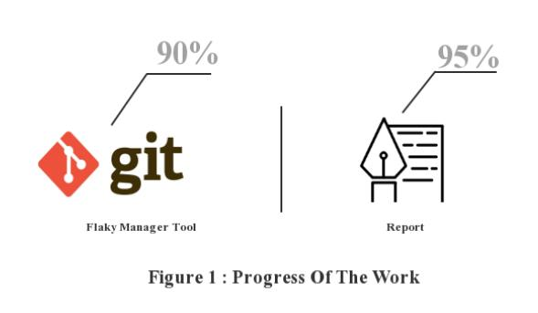
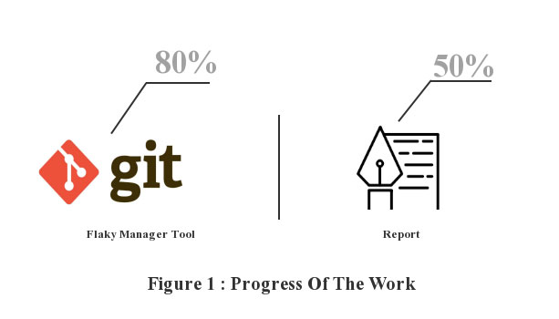
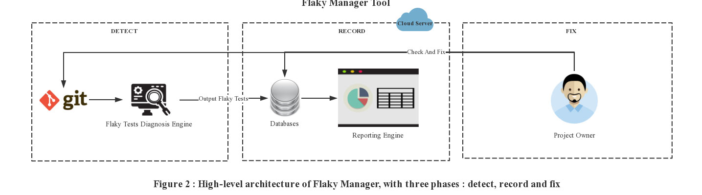
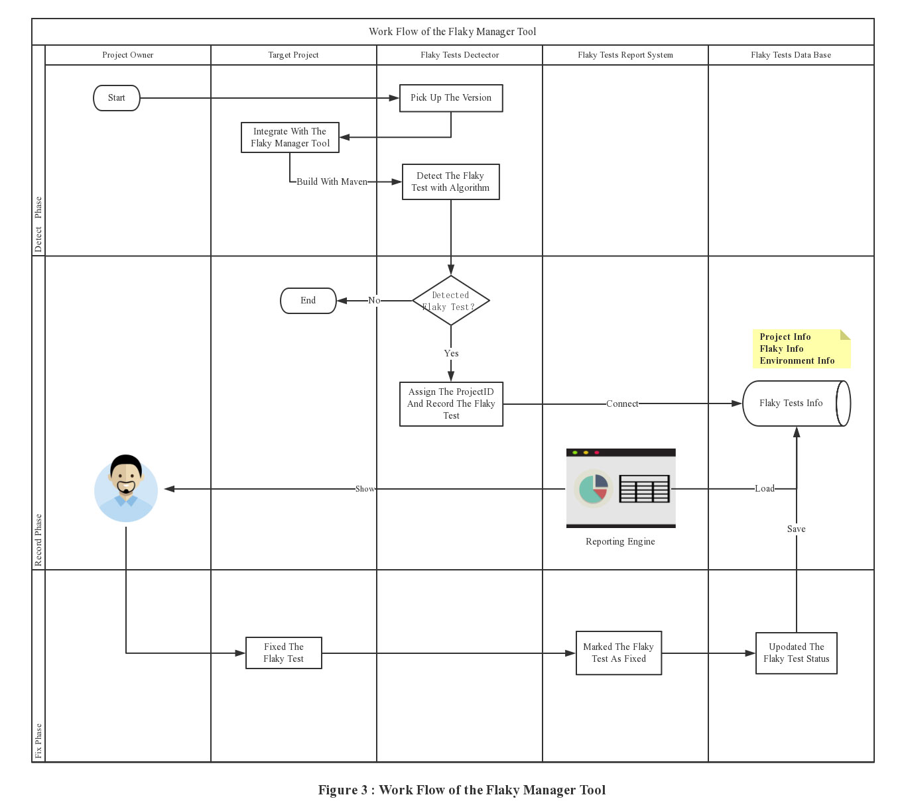

# FLAKY MANAGER PROJECT PROGRESS

## **PROGRESS OF THE PERCENTAGE VIEW**

_++Cut off **2019-03-04**++_


_++Cut off **2019-02-25**++_



* * *

## **PERSPECTIVE**

Before starting any further work, I would like to share with you my thoughts on this exercise.After investigation, I found that the test results of Flaky Tests are uncertain. Some people believe that Flaky Tests can not achieve the test objectives, and may even destroy the test value. DeFlaker is very professional in finding flaky tests. I think finding them is the first step. We need to solve these flaky tests. So my idea is to build a tool to manage the life cycle of flaky tests, from discovery to record and then fix it.



****

## **HIGH-LEVEL ARCHITECTURE**

So, The tool is divided into three parts：

- **The first part** is used to discover flaky tests tools, need to be integrated into the target project, detects the flaky tests and show the information of the flaky manager tool.


- **The second part** is to report the discovery of flaky tests to the cloud server, for the same test case, we upload data related to the operating environment each time,Because changes in the operating environment of the program often lead to the generation of flaky tests.

```
mysql> desc flaky;
+------------------+--------------+------+-----+---------+----------------+
| Field            | Type         | Null | Key | Default | Extra          |
+------------------+--------------+------+-----+---------+----------------+
| flaky_id         | int(13)      | NO   | PRI | NULL    | auto_increment |
| flaky_status     | int(2)       | YES  |     | NULL    |                |
| last_detect_time | datetime     | YES  |     | NULL    |                |
| last_sha_1       | varchar(255) | YES  |     | NULL    |                |
| class_name       | varchar(255) | YES  |     | NULL    |                |
| unit_test_name   | varchar(255) | YES  |     | NULL    |                |
| detect_count     | int(100)     | YES  |     | NULL    |                |
| project_id       | varchar(255) | YES  |     | NULL    |                |
+------------------+--------------+------+-----+---------+----------------+
8 rows in set (0.04 sec)

mysql> desc flaky_history;
+--------------------+--------------+------+-----+---------+----------------+
| Field              | Type         | Null | Key | Default | Extra          |
+--------------------+--------------+------+-----+---------+----------------+
| flaky_history_id   | int(13)      | NO   | PRI | NULL    | auto_increment |
| flaky_id           | int(13)      | NO   |     | NULL    |                |
| flaky_status       | int(2)       | YES  |     | NULL    |                |
| detect_time        | datetime     | YES  |     | NULL    |                |
| sha_1              | varchar(255) | YES  |     | NULL    |                |
| class_name         | varchar(255) | YES  |     | NULL    |                |
| unit_test_name     | varchar(255) | YES  |     | NULL    |                |
| detect_count       | int(100)     | YES  |     | NULL    |                |
| project_id         | varchar(255) | YES  |     | NULL    |                |
| environment_detail | text         | YES  |     | NULL    |                |
+--------------------+--------------+------+-----+---------+----------------+
10 rows in set (0.05 sec)

mysql> 
```

- **The third part** is the cloud server used to manage flaky tests, and we can see the reports related to the target project at a glance and manage their lifecycle by flaky tests status tags.


## **WORKFLOW**

Finally, here is the work flow of the flaky manager tool. If there is something wrong with my understanding, don't hesitate to let me know.



